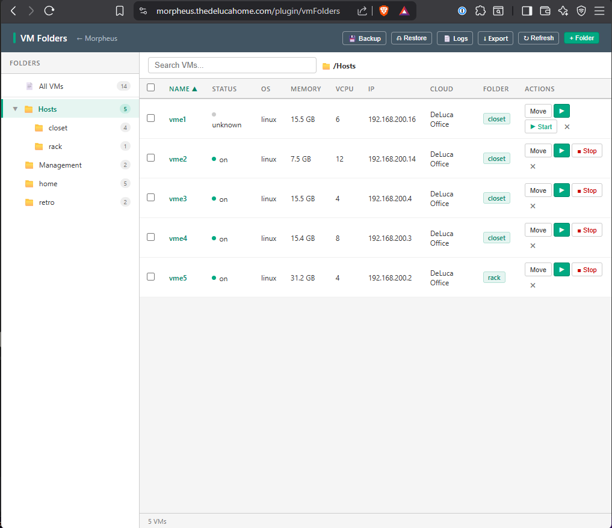

# morpheus-vm-folders-plugin

A vCenter-style VM folder organization plugin for HPE Morpheus.  
Organize, move, and manage VMs in a persistent folder tree — directly from the Morpheus UI.



---

## Features

- 📁 **Folder tree** — create, rename, delete, and collapse folders
- 🖱️ **Move VMs** — single or multi-select, drag-to-folder or Move button
- 🔍 **Search & sort** — filter VMs by name, IP, OS, or cloud
- ⚡ **Power control** — Start / Stop VMs directly from the folder view
- 🖥️ **Console access** — one-click console button per VM
- 💾 **Persistent storage** — folder assignments stored in a JSON file on the appliance
- 🔄 **Backup & restore** — one-click backup, restore from backup
- 📤 **Export / Import** — download the full database as JSON
- 📋 **Log viewer** — built-in log collection with export to .txt
- 🎨 **HPE color scheme** — matches HPE Morpheus branding

**VM details shown:**
- Power state (color-coded dot)
- OS type
- Memory (GB/MB)
- vCPU count
- IP address
- Cloud/cluster name
- Folder assignment

---

## Compatibility

| Morpheus Edition | Tested | Notes |
|---|---|---|
| HPE VM Essentials | ✅ | Fully tested |
| Morpheus Enterprise | ✅ | Fully tested |
| Morpheus Community | ✅ | Fully tested |

**Minimum Morpheus version:** 8.x  
**Plugin API version:** 1.3.3

---

## Quick Install (no build required)

1. Download the latest jar from [Releases](https://github.com/YOUR_USERNAME/morpheus-vm-folders-plugin/releases/latest)
2. In Morpheus: **Admin → Integrations → Plugins → Upload**
3. Select the jar file and click Upload
4. Navigate to: `https://your-morpheus-url/plugin/vmFolders`

That's it. No restart required.

---

## Usage

### Accessing the Plugin

After install, the VM Folders page is available at:
```
https://your-morpheus-url/plugin/vmFolders
```

Bookmark it or add it to your browser favorites.

### Creating Folders

1. Click **+ Folder** in the top right
2. Enter a path using `/` for nesting — e.g. `/Production/Web`
3. Click **Create**
4. The Move dialog opens automatically so you can assign VMs immediately

Folders are persistent — they survive page reloads even with no VMs assigned.

### Moving VMs

**Single VM:** Click the **Move** button on any VM row  
**Multiple VMs:** Check the checkboxes, then click **Move Selected**  
**Remove from folder:** Click the **✕** button or Move to Unorganized

### Folder Tree

- Click any folder to filter the VM list to that folder
- Sub-folders are shown with indentation
- Click **▼/▶** arrows to collapse/expand folders with children
- Hover over a folder to reveal **✎ rename** and **✕ delete** buttons

### Power Control

- **▶ Start** / **■ Stop** buttons appear per VM based on current state
- Power actions use the Morpheus API server-side — no token required

### Console

Click the **▶** console button on any VM to open the hypervisor console in a new tab.

### Backup & Restore

| Button | Action |
|---|---|
| 💾 Backup | Copies the database to `vm-folders.json.bak` |
| ⏏ Restore | Restores from the `.bak` file (with confirmation) |
| ↓ Export | Downloads the full database as a timestamped JSON file |

### Log Viewer

Click **📄 Logs** to open the built-in log viewer. Filter by keyword or show all. Export logs as a `.txt` file for sharing or troubleshooting.

---

## Data Storage

All folder assignments are stored in a JSON file on the Morpheus appliance:

```
/var/opt/morpheus/morpheus-ui/plugins/vm-folders.json
```

**Schema:**
```json
{
  "version": 12,
  "lastModified": "2026-04-24T...",
  "folders": [
    { "path": "/Production/Web", "desc": "Web servers", "created": "..." }
  ],
  "assignments": {
    "29": "/Production/Web",
    "65": "/Home Automation"
  },
  "history": [
    { "ts": "...", "action": "assign", "vmId": "29", "path": "/Production/Web" }
  ]
}
```

A backup is automatically created at `vm-folders.json.bak` on every write.

---

## Building from Source

**Requirements:**
- JDK 11 (`sudo apt install openjdk-11-jdk`)
- SDKMAN for Gradle (`sdk install gradle 7.6.4`)

```bash
git clone https://github.com/YOUR_USERNAME/morpheus-vm-folders-plugin
cd morpheus-vm-folders-plugin

sdk use gradle 7.6.4
export JAVA_HOME=/usr/lib/jvm/java-11-openjdk-amd64

gradle shadowJar --no-daemon
# Output: build/libs/morpheus-vm-folders-plugin-1.0.0-all.jar
```

---

## Standalone Version (no plugin required)

For Morpheus instances without plugin upload access, a standalone HTML version is available in the [`standalone/`](standalone/) directory.

**Install:**
```bash
# On the Morpheus appliance
sudo cp standalone/vmfolders/index.html /opt/morpheus/embedded/nginx/html/vmfolders/
sudo cp standalone/vmfolders-api.py /opt/morpheus/vmfolders-api.py
sudo cp standalone/vmfolders-api.service /etc/systemd/system/
sudo systemctl enable --now vmfolders-api
```

Add to nginx config (inside `server {}` block):
```nginx
location /vmfolders/ {
    alias /opt/morpheus/embedded/nginx/html/vmfolders/;
    index index.html;
}
location /vmfolders-api/ {
    proxy_pass http://127.0.0.1:8181/;
}
```

Access at: `https://your-morpheus-url/vmfolders/`

The standalone version shares the same `vm-folders.json` database as the plugin.

---

## Bookmarklet

For instant access on any Morpheus page without any server-side install:

1. Install the standalone files (above)
2. Navigate to: `https://your-morpheus-url/vmfolders/bookmarklet-install.html`
3. Drag the green button to your bookmarks bar
4. Click it on any Morpheus page — VM Folders slides in as a side panel

---

## Docker / Container

A self-contained Docker image is available in [`container/`](container/):

```bash
cd container
docker compose up -d
# Access at http://your-host:8090
```

**Sharing data with the plugin** via NFS (recommended):
```yaml
# docker-compose.yml
volumes:
  - /mnt/morpheus-plugins:/data  # NFS mount of plugin directory
```

See [`container/README.md`](container/README.md) for full NFS/NAS setup instructions.

---

## Known Issues & Workarounds

| Issue | Affected | Workaround |
|---|---|---|
| VM metadata API returns Strings | HPE VME 8.1.1 | Plugin uses JSON file storage instead |
| `getMetaData()` write-back broken | HPE VME 8.1.1 | Plugin uses JSON file storage instead |
| Asset pipeline cache (300s) | All | Wait 5 min after plugin update before testing JS changes |

---

## Roadmap

- [ ] Folder-level power control (start/stop all VMs in folder)
- [ ] VM notes field stored in database
- [ ] Drag-and-drop VM assignment
- [ ] Folder color labels
- [ ] JSON import via file upload in UI
- [ ] Home Assistant integration
- [ ] Multi-user support (per-user folder views)
- [ ] Morpheus Catalog Item for self-install

---

## Contributing

Pull requests welcome. Please test against both HPE VM Essentials and Morpheus Community before submitting.

For HPE VME-specific issues, note the Morpheus version and check [`docs/dev-log.md`](docs/dev-log.md) for known quirks.

---

## License

MIT License — see [LICENSE](LICENSE)

---

## Author

Travis DeLuca — [@tdeluca](https://github.com/YOUR_USERNAME)  
Built for the HPE Morpheus community.
