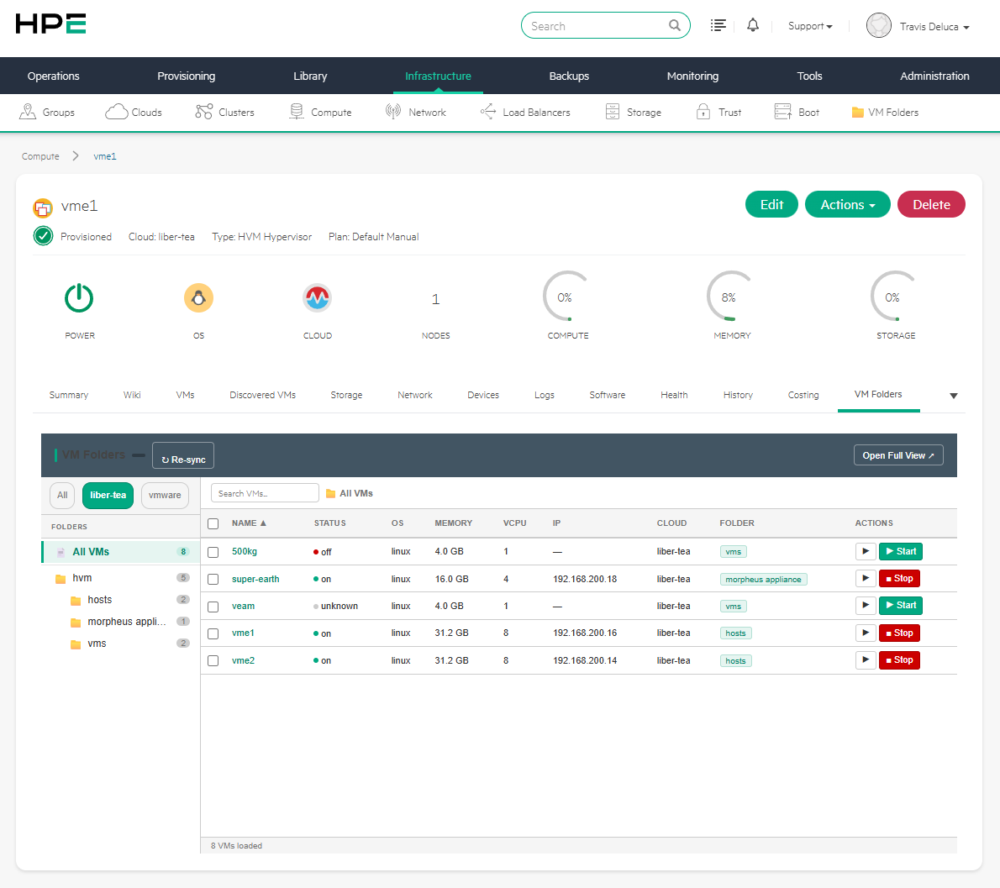

# VM Folders — HPE Morpheus Plugin

Folder organization for VMs in HPE Morpheus VM Essentials. Organize, browse, and control virtual machines across clouds.



---

## Features

### Core (v1.0.0)
- **Folder tree** — create, rename, delete, collapse/expand folders
- **VM table** — NAME, STATUS, OS, MEMORY, vCPU, IP, CLOUD, FOLDER, ACTIONS
- **Power control** — Start / Stop per VM via Morpheus API
- **Console access** — opens Morpheus hypervisor console in a new tab
- **Search & sort** — filter VMs by name, IP, OS, cloud
- **Multi-select move** — assign multiple VMs to a folder at once
- **Backup / Restore / Export** — JSON database snapshots
- **Log viewer** — plugin event log with export
- **Dark / light theme** — auto-syncs to Morpheus UI dark mode setting
- **HPE branding** — HPE green (#01A982), standard header (#425563)

### v1.1.0
- **Cloud tabs** — All | cloud1 | cloud2 above the folder tree, auto-populated from loaded VMs
- **Cloud context auto-detection** — reads the Morpheus page DOM to auto-select the correct cloud when viewing from a host or cluster tab
- **Embedded tab providers:**
  - **Infrastructure → Clusters → (cluster) → VM Folders** — read-only view scoped to that cluster
  - **Infrastructure → Compute → Hosts → (host) → VM Folders** — read-only view scoped to that host with Re-sync button
  - **Provisioning → Instances → (instance) → VM Folders** — shows folder membership with quick-assign
- **Navigation injection:**
  - **Infrastructure sub-nav** — VM Folders link after Boot
  - **Provisioning sub-nav** — VM Folders link after Code
  - **Provisioning hover dropdown** — VM Folders in the flyout menu
  - **Infrastructure → Clouds detail** — VM Folders tab on cloud detail pages
- **Auto-Organize** — one-click Cloud → Host folder hierarchy with automatic VM assignment
- **Re-sync Hosts** — updates folder assignments after VME live-migrates VMs between hosts
- **Read-only embedded tabs** — cluster/server/instance tabs hide edit, delete, move controls
- **Dark mode auto-sync** — CSS variable injection that survives React re-renders
- **Start/Stop buttons** — white text on solid green/red, visible without hover

---

## Requirements

| Component | Version |
|---|---|
| HPE Morpheus VM Essentials | 8.1.0+ (tested 8.1.1, 8.8) |
| morpheus-plugin-api | 1.3.0 |
| Java | 11 |
| Gradle | 7.6.4 |

---

## Installation

1. Download the latest `.jar` from [Releases](../../releases)
2. In Morpheus: **Administration → Integrations → Plugins → Upload Plugin**
3. Upload `morpheus-vm-folders-plugin-{version}-all.jar`
4. Plugin activates immediately — no restart required

Database file auto-created at:
```
/var/opt/morpheus/morpheus-ui/plugins/vm-folders.json
```

---

## Building from Source

```bash
sdk use gradle 7.6.4
export JAVA_HOME=/usr/lib/jvm/java-11-openjdk-amd64

git clone https://github.com/builtbyfood/morpheus-vm-folders
cd morpheus-vm-folders
gradle shadowJar --no-daemon
# → build/libs/morpheus-vm-folders-plugin-{version}-all.jar
```

---

## Usage

### Standalone Page
Navigate to `https://your-morpheus/plugin/vmFolders`

Also accessible from:
- Infrastructure sub-nav → VM Folders
- Provisioning sub-nav → VM Folders
- Provisioning hover dropdown → VM Folders

### Embedded Tabs
VM Folders appears as a native tab on:
- **Infrastructure → Clusters → (cluster)** — cluster VMs filtered to cloud
- **Infrastructure → Compute → Hosts → (host)** — VMs on that host + Re-sync
- **Infrastructure → Clouds → (cloud)** — injected via JavaScript
- **Provisioning → Instances → (instance)** — folder membership + assign

### Cloud Tabs
The folder tree header shows **All | cloud1 | cloud2** tabs.
- In embedded tabs the correct cloud is auto-selected from Morpheus page context
- In the standalone page click a tab to filter

### Auto-Organize
The ⚙ Auto-Organize button creates a Cloud → Host hierarchy and assigns all VMs:
```
/liber-tea/vme1/
/liber-tea/vme2/
/vmware/esxi1/
```

### Re-sync Hosts
After VME live-migrates a VM, click **↺ Re-sync** (host tab header or `GET /plugin/vmFolders/resync`) to update folder assignments to match current host locations.

---

## Architecture

```
src/
├── assets/javascript/
│   └── vmFolders.js                        # Full SPA + nav injection + dark mode
├── main/
│   ├── groovy/com/morpheusdata/vmfolders/
│   │   ├── VmFoldersPlugin.groovy          # Entry point, provider registration
│   │   ├── VmFoldersController.groovy      # SPA page + all API endpoints
│   │   ├── VmFoldersNavProvider.groovy     # GlobalUIComponentProvider
│   │   ├── VmFoldersClusterTabProvider.groovy
│   │   ├── VmFoldersServerTabProvider.groovy
│   │   └── VmFoldersInstanceTabProvider.groovy
│   └── resources/renderer/hbs/
│       ├── vmFoldersNav.hbs               # CSS variables on every page
│       ├── vmFoldersClusterTab.hbs
│       ├── vmFoldersServerTab.hbs
│       └── vmFoldersInstanceTab.hbs
```

### API Endpoints (`/plugin/vmFolders/...`)

| Endpoint | Description |
|---|---|
| `GET /` | Standalone SPA page |
| `GET /vms` | All compute servers (proxied) |
| `GET /db` | Current folder/assignment database |
| `POST /saveFolder` | Create or update folder |
| `POST /delFolder` | Delete folder |
| `POST /renFolder` | Rename folder |
| `POST /assign` | Assign VM to folder |
| `POST /unassign` | Remove VM from folder |
| `GET /power` | Start / Stop / Restart |
| `GET /resync` | Re-sync host assignments |
| `GET /serverActions` | Available actions for a server |
| `POST /backup` | Download DB backup |
| `POST /restore` | Restore DB from backup |
| `GET /export` | Export DB as JSON |
| `GET /logs` | Plugin log entries |

---

## Known Limitations

- **No `AbstractCloudTabProvider`** in API 1.3.0 — cloud detail tab uses JS injection instead
- **VMware console** — uses Morpheus hypervisor proxy; native VMware HTML Console SDK planned for v1.2.0
- **Per-cloud folder namespacing** — cloud tabs are a UI filter; true isolation planned for v1.2.0
- **VME Migrator conflict** — if VME Migrator's `MigrationController` throws `MissingPropertyException: Permission` it breaks all plugin routes; fix by rebuilding VME Migrator with the correct `Permission` import

---

## Roadmap

### v1.2.0
- Per-cloud folder namespacing (JSON schema v2)
- VMware HTML Console SDK integration
- XML Editor plugin integration (auto-detect when installed)
- Column resizing with localStorage persistence

---

## Author

Travis DeLuca — [@builtbyfood](https://github.com/builtbyfood)  
Built for the HPE Morpheus community.
